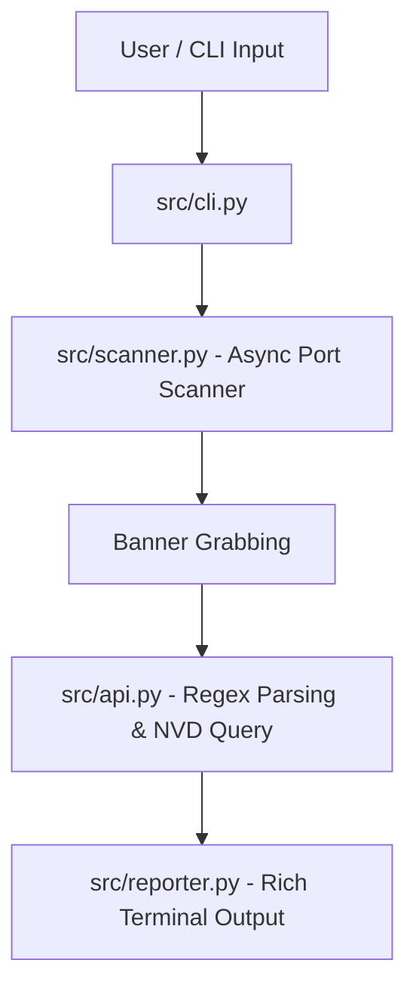

# VulnScanner CLI

[](https://github.com/<PrestigeDK>/vuln-scanner/actions)


An asynchronous, lightweight CLI tool designed for port scanning, banner grabbing, and automated CVE (Common Vulnerabilities and Exposures) lookups via the NIST NVD API v2.

---

## Architecture Overview



---

## Key Features

- **Asynchronous Port Scanner:** Non-blocking scan using Python's `asyncio` with semaphore-based concurrency control.
- **Service & Banner Parsing:** Regex-based extraction of software names and versions from raw TCP banners.
- **Automated CVE Lookup:** Integration with the official NIST National Vulnerability Database (NVD) API v2.
- **Terminal UI:** Color-coded severity ratings and structured tables powered by `Rich`.
- **Fully Containerized:** Pre-configured Docker environment ready for instant execution anywhere.
- **Automated Quality Control:** Full test coverage with `pytest` and automated CI/CD via GitHub Actions.

---

## Installation & Local Setup

Clone the repository and set up a virtual environment:

```bash
git clone https://github.com/<YOUR_GITHUB_USERNAME>/vuln-scanner.git
cd vuln-scanner
python3 -m venv venv
source venv/bin/activate
pip install -r requirements.txt
```

---

## Usage Examples

### 1. Basic Scan
Scan a target using default ports (`21, 22, 80, 443, 8080, 8443`):

```bash
python -m src.cli scanme.nmap.org
```

### 2. Custom Ports & CVE Limit
Specify target ports and limit the maximum number of retrieved CVEs per service:

```bash
python -m src.cli scanme.nmap.org --ports 22,80,443 --max-cves 5
```

### 3. Run with Docker / Podman
Run the scanner inside an isolated container without setting up local Python dependencies:

```bash
# Build the image
docker build -t vulnscanner .

# Execute a scan
docker run --rm vulnscanner scanme.nmap.org --ports 22,80,443
```

---

## Running Unit Tests

Execute the test suite using `pytest`:

```bash
pytest -v
```

---

## Project Structure

```text
vuln-scanner/
├── .github/
│   └── workflows/
│       └── ci.yml        # GitHub Actions CI pipeline
├── src/
│   ├── __init__.py
│   ├── api.py            # Banner parsing & NVD API integration
│   ├── cli.py            # Typer CLI entrypoint
│   ├── reporter.py       # Rich terminal UI & table rendering
│   └── scanner.py        # Async port scanner & banner grabber
├── tests/
│   ├── test_api.py       # Banner parsing unit tests
│   └── test_scanner.py   # Async scanner unit tests
├── Dockerfile            # Container image definition
├── pytest.ini            # Pytest configuration
├── requirements.txt      # Project dependencies
└── README.md             # Project documentation
```